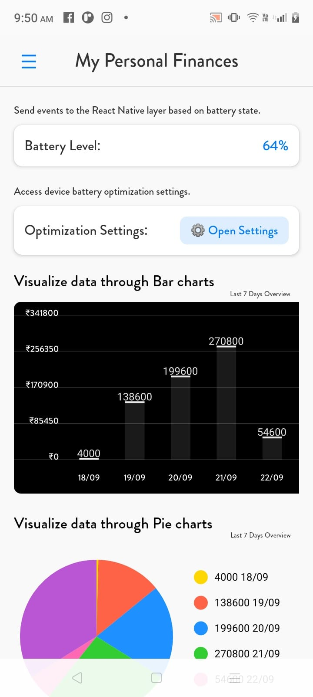
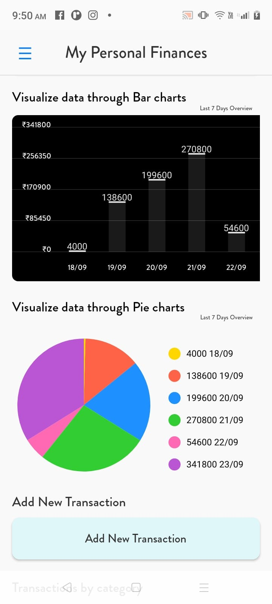
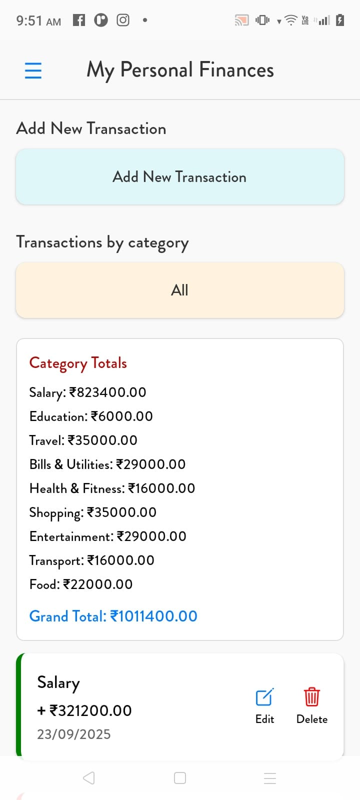
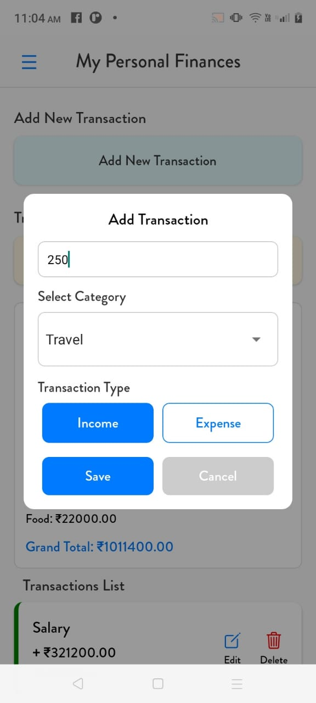
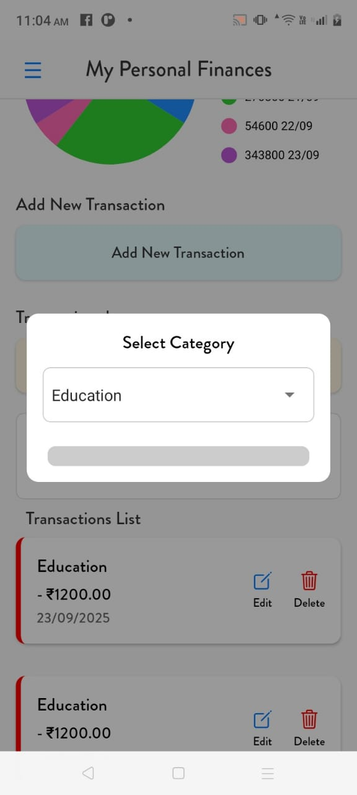
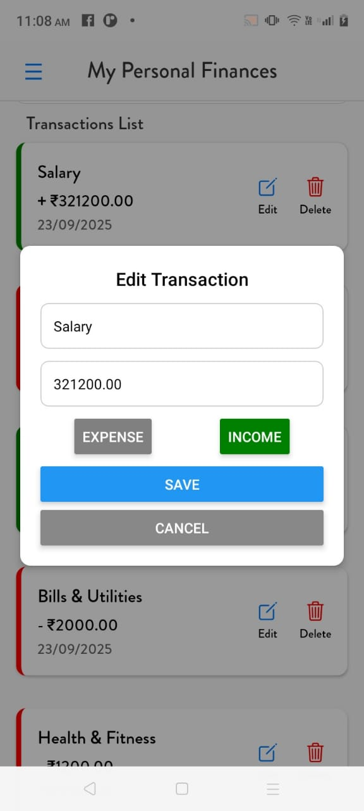
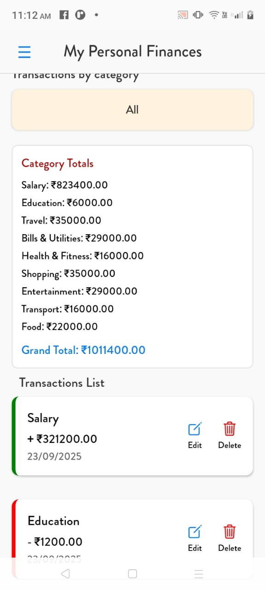
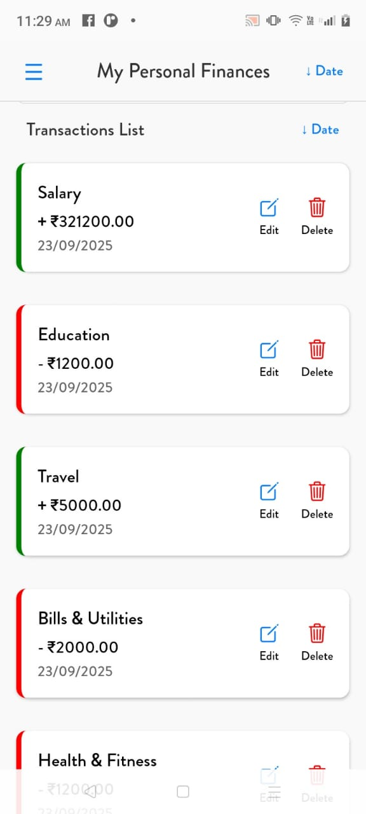

# Advanced Mobile Application Development – Personal Finance App

## Project Overview
This project is a cross-platform personal finance management mobile app built using **React Native**, with native module integration for iOS (Swift) and Android (Kotlin).  
It allows users to manage transactions, visualize spending, and sync data with backend APIs.

### Demo Video
[Watch Demo Video](assets/demo.mp4)

### Screenshots

| Screenshot 1 | Screenshot 2 | Screenshot 3 |
|--------------|--------------|--------------|
|    *1. Access device battery optimization settings. 2.based on battery state.* |    *1. Visualize data through react-native-chart-kit (bar chart, pie chart). * |    *1.List transactions with infinite scroll. 2. Sync data with a backend API [real].* |

| Screenshot 4 | Screenshot 5 | Screenshot 6 |
|--------------|--------------|--------------|
|    *Add new transactions using forms and validation.* |    *Categorize transactions (e.g., Food, Transport, Entertainment).* |    *1. Add, edit, and delete income and expense entries.* |

| Screenshot 7 | Screenshot 8 | Screenshot 9 |
|--------------|--------------|--------------|
|    *View transactions grouped by category and calculate total spending per category.* |    *Sort transactions by date in descending order for easier tracking.* |    *Delete income and expense entries quickly and efficiently.* |

---

## Features

### 1. Transaction Management
- Add new income and expense entries with validation.
- Edit existing transactions.
- Delete transactions.
- Categorize transactions (e.g., Food, Transport, Entertainment).
- Infinite scroll for transaction list using `FlatList`.

### 2. Data Visualization
- Bar chart and pie chart for expense and income analysis.
- Integrated `react-native-chart-kit` for charts.

### 3. Backend Integration
- Simulated backend API using real Fetch.

### 4. Native Module Integration
- **iOS (Swift):** Access local calendar and sync transactions with reminders.
- **Android (Kotlin):** Access battery optimization settings and send events to React Native.

### 5. Algorithms & Data Handling
- Group transactions by category and calculate total spending per category.
- Sort transactions by date in descending order.

### 6. Performance Optimization
- Lazy loading of transaction entries.
- Optimized `FlatList` rendering with `keyExtractor`.
- Reduced unnecessary re-renders using `React.memo`.

### 7. Version Control & Documentation
- Git repository with clean, separate commits for each feature.
- Clear commit messages explaining each feature added.

---

## Project Structure

/ProjectRoot
/android # Android native code (Kotlin)
/ios # iOS native code (Swift)
/src
/components # Reusable components (buttons, modals, charts)
/screens # React Native screens
/context # State management using React Context / Redux
/services # API integration (real Fetch)
/utils # Utility functions (sorting, grouping, interest calculation)
App.tsx # Main app entry point
package.json # Project dependencies
README.md # Project documentation

---

## Dependencies
- **React Native**
- **react-native-chart-kit** – for charts
- **Real API** – API requests
- **React Context / Redux** – state management

---

## Known Issues & Improvements
- Backend API is currently simulated; real backend integration can be added.
- More advanced charts (trend analysis, filter by date) can be included.
- Additional error handling and offline support improvements.

---

## Version Control
- Initialized Git repository.
- Each feature committed separately.
- Commit messages are self-explanatory, e.g.:
  - `feat: add transaction addition and validation`
  - `feat: integrate bar and pie charts`
  - `feat: add iOS native calendar module`
  - `perf: optimize FlatList rendering`
